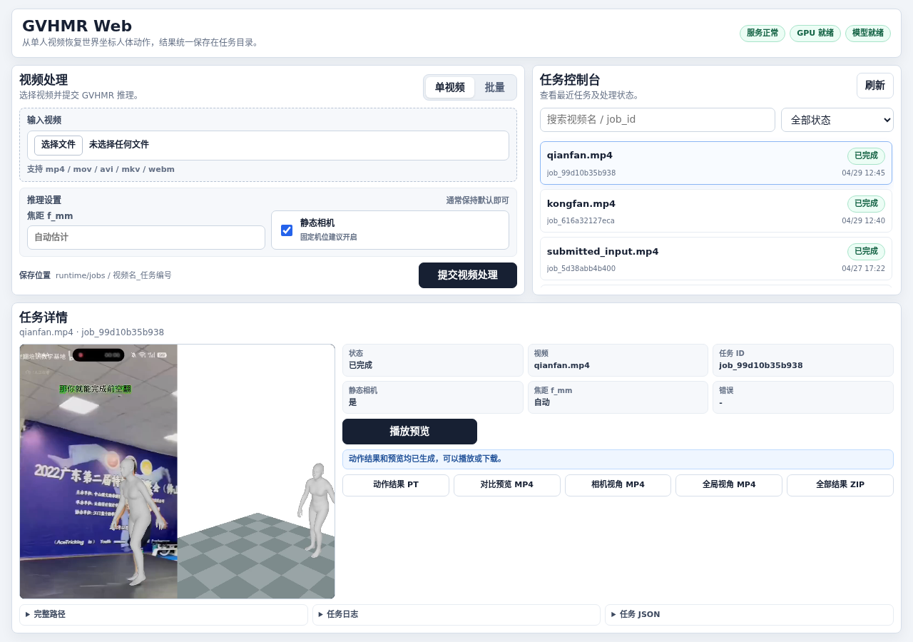

# GVHMR Web 工具

[English README](README.en.md)

把 [GVHMR](https://github.com/zju3dv/GVHMR) 的单人视频人体动作恢复流程封装成一个可部署的本地 Web 工具。源码模式已经内置 GVHMR-Enhanced：默认使用 FootMR 做脚踝细化，并可选自动平地约束，不再要求旁路安装 `gvhmr-core-opt`。



## 主要功能

- 单视频与批量上传，支持 `mp4 / mov / avi / mkv / webm`
- 静态相机和可选焦距 `f_mm`
- FootMR COCO23 脚踝残差细化，以及隔离的预处理缓存
- 可选自动平地约束；Human3R 场景约束代码已纳入实验工具，但 Web 中暂不启用
- SQLite 任务持久化、状态筛选、取消和失败重试
- 推理完成后按需生成预览，预览失败不会破坏人体动作结果
- 页面内播放预览，并分别下载 PT、相机视角、全局视角或 ZIP
- 上传临时文件自动清理，任务输入和结果统一保存在任务目录
- Docker 优先的一键部署，以及供开发者使用的源码模式

## 使用流程

1. 上传视频并提交 GVHMR 推理。
2. 在右侧任务控制台查看状态，失败任务可以重试。
3. 下载 `hmr4d_results.pt`，或点击“生成预览”检查恢复效果。

## 快速启动

运行环境需要 Linux x86_64、NVIDIA GPU、可用驱动、Docker 和 NVIDIA Container Toolkit。

```bash
bash doctor.sh
bash start_web.sh
```

浏览器访问：

```text
http://127.0.0.1:7860/
```

查看状态或停止服务：

```bash
bash status.sh
bash stop_web.sh
```

第一次启动会构建 Docker 镜像并下载模型，总下载量约 `16GB ~ 17GB`。完整说明见 [快速开始](docs/QUICKSTART.md) 和 [部署说明](docs/DEPLOYMENT.md)。

要运行当前内置的 GVHMR-Enhanced，请使用已有的 `gvhmr` Conda 环境：

```bash
conda activate gvhmr
python tools/demo/download_footmr_assets.py
bash start_web_source.sh
```

源码启动默认以当前仓库作为算法 core；只有需要切换其他 worktree 时才设置 `GVHMR_CORE_ROOT`。Docker 启动路径目前仍保留原始 GVHMR baseline。

## 输出内容

每个任务默认保存到：

```text
runtime/jobs/<视频名>_<任务短 ID>/
```

核心产物：

- `hmr4d_results.pt`：GVHMR 人体动作结果
- `job.json`：任务摘要
- `artifacts.zip`：当前可用结果的打包文件

按需生成的预览：

- `1_incam.mp4`
- `2_global.mp4`
- `*_3_incam_global_horiz.mp4`

`submitted_input.*`、`0_input_video.mp4` 和 `_gvhmr_work/` 属于任务输入或中间文件，不是稳定的数据交换格式。

## 文档

- [快速开始](docs/QUICKSTART.md)
- [Docker 与局域网部署](docs/DEPLOYMENT.md)
- [源码开发环境](docs/INSTALL.md)
- [常见问题](docs/TROUBLESHOOTING.md)

## 适用范围

- 当前只处理单人主轨，不提供多人身份管理。
- GVHMR 推理要求 CUDA，不支持 CPU 推理。
- 默认 Web 服务是独立工具，不依赖 GMR Web。
- `runtime/`、模型权重和 Docker 镜像不提交到 Git。

## 上游与引用

本工具基于原始 GVHMR 项目：

- 项目主页：https://zju3dv.github.io/gvhmr
- 论文：https://arxiv.org/abs/2409.06662
- 上游仓库：https://github.com/zju3dv/GVHMR

使用 GVHMR 研究成果时，请引用原论文：

```bibtex
@inproceedings{shen2024gvhmr,
  title={World-Grounded Human Motion Recovery via Gravity-View Coordinates},
  author={Shen, Zehong and Pi, Huaijin and Xia, Yan and Cen, Zhi and Peng, Sida and Hu, Zechen and Bao, Hujun and Hu, Ruizhen and Zhou, Xiaowei},
  booktitle={SIGGRAPH Asia Conference Proceedings},
  year={2024}
}
```

源码模式默认启用的脚踝细化来自 FootMR：

```bibtex
@InProceedings{wehrbein26footmr,
  author    = {Wehrbein, Tom and Rosenhahn, Bodo},
  title     = {Improving 3D Foot Motion Reconstruction in Markerless Monocular Human Motion Capture},
  booktitle = {IEEE/CVF Winter Conference on Applications of Computer Vision (WACV)},
  year      = {2026}
}
```
